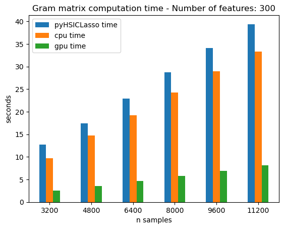

# HISEL
## Feature selection tool based on Hilbert-Schmidt Independence Criterion
Feature selection is
the machine learning 
task
of selecting from a data set
the features 
that are relevant 
for the prediction of a given target.
The `hisel` package 
provides feature selection methods 
based on 
Hilbert-Schmidt Independence Criterion.
In particular,
it provides an implementation of the HSIC Lasso algorithm of
[Yamada, M. et al. (2012)](https://arxiv.org/abs/1202.0515). 

## Why is `hisel` cool?

#### `hisel` is accurate
HSIC Lasso is an excellent algorihtm for feature selection.
This makes `hisel` an accurate tool in your machine learning modelling.
Moreover, 
`hisel` implements clever routines 
that address common causes of poor accuracy in other feature selection methods.

Examples of where `hisel` outperforms the methods in 
[sklearn.feature\_selection](https://scikit-learn.org/stable/modules/classes.html#module-sklearn.feature_selection)
are given in the notebooks
`ensemble-example.ipynb`
and
`nonlinear-transform.ipynb`.


#### `hisel` is fast
A crucial step in the HSIC Lasso algorithm 
is the computation of
certain Gram matrices. 
`hisel` implemets such computations
in a highly vectorised and performant way. 
Moreover, 
`hisel` allows you to 
accelerate these computations
 using a GPU. 
The image below shows 
the average run time 
of the computations
of Gram matrices 
via 
`hisel` on CPU, 
via
`hisel` on GPU,
and 
via 
[pyHSICLasso](https://pypi.org/project/pyHSICLasso/).
The performance has been measured 
on the computation 
of Gram matrices required 
by HSIC Lasso 
for the selection 
from a dataset of 300 features 
with as many samples as reported on the x-axis. 




#### `hisel` has a friendly user interface

Getting started with `hisel` is as straightforward as the following code snippet:
```
    >>> import pandas as pd
    >>> import hisel
    >>> df = pd.read_csv('mydata.csv')
    >>> xdf = df.iloc[:, :-1]
    >>> yser = df.iloc[:, -1]
    >>> hisel.feature_selection.select_features(xdf, yser)
    ['d2', 'd7', 'c3', 'c10', 'c12', 'c24', 'c22', 'c21', 'c5']
```
If you are not interested in more details, 
please read no further. 
If you would like to 
explore more about
how to tune the hyper-parameters used by `hisel` 
or 
how to have more advanced control on `hisel`'s selection,
please browse the examples in 
[examples/](https://github.com/transferwise/hisel/tree/trunk/examples)
and in
[notebooks](https://github.com/transferwise/hisel/tree/trunk/notebooks).


## Installation

### Install via `pip`

The package [hisel](https://pypi.org/project/hisel/) is available from [PyPi](https://pypi.org/). 
You can install it via `pip`:
```
pip install hisel 
```

If you want to install the extra support for GPU computations, you can do
```
pip install hisel[cudaXXX]
```
where `cudaXXX` is one of the following:
`cuda102` if you have version 10.2 of cuda-toolkit;
`cuda110` if you have version 11.0 of cuda-toolkit;
`cuda111` if you have version 11.1 of cuda-toolkit;
`cuda11x` if you have version 11.2 - 11.8 of cuda-toolkit;
`cuda12x` if you have version 12.x of cuda-toolkit.

### Install from source

#### Basic installation:
Checkout the repo and navigate to the root directory. Then, 
```
poetry install
```


#### Installation with GPU support
You need to have cuda-toolkit installed and you need to know its version.
To know that, you can do 
```
nvidia-smi
```
and read the cuda version from the top right corner of the table that is printed out. 
Once you know your version of `cuda`, do 
```
poetry install -E cudaXXX
```
where `cudaXXX` is one of the following:
`cuda102` if you have version 10.2;
`cuda110` if you have version 11.0;
`cuda111` if you have version 11.1;
`cuda11x` if you have version 11.2 - 11.8;
`cuda12x` if you have version 12.x.
This aligns to the [installation guide of CuPy](https://docs.cupy.dev/en/stable/install.html#installing-cupy).


